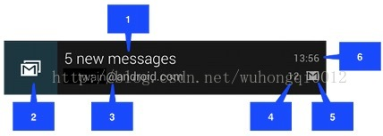
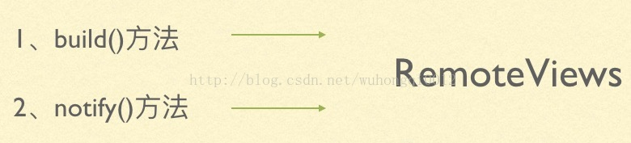
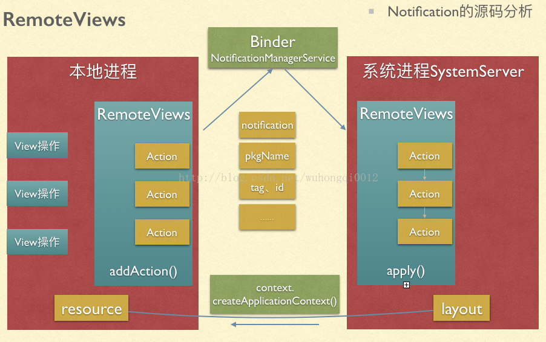
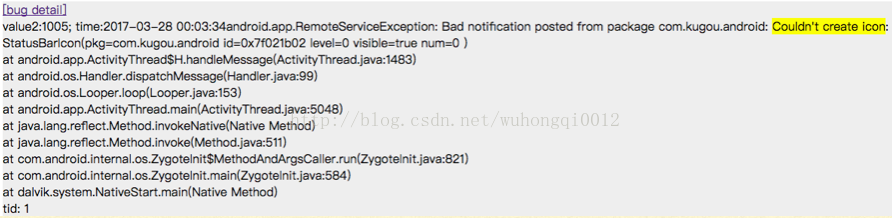
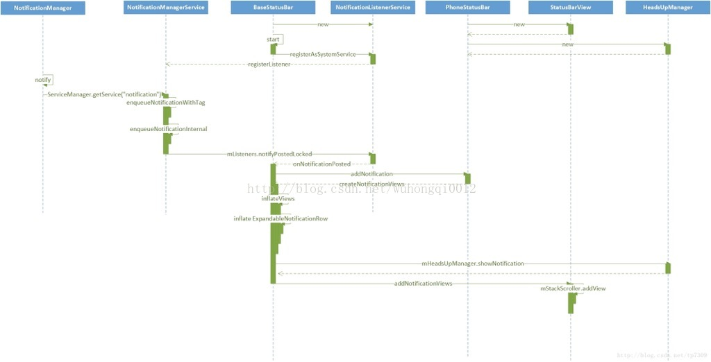
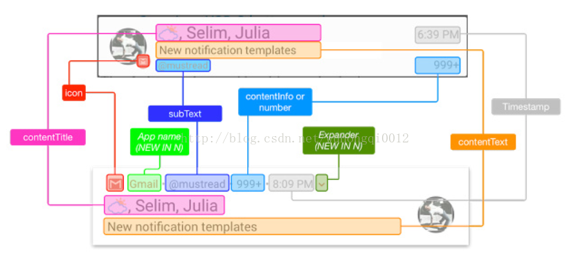
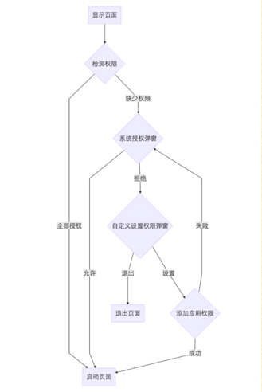
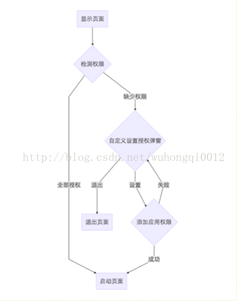
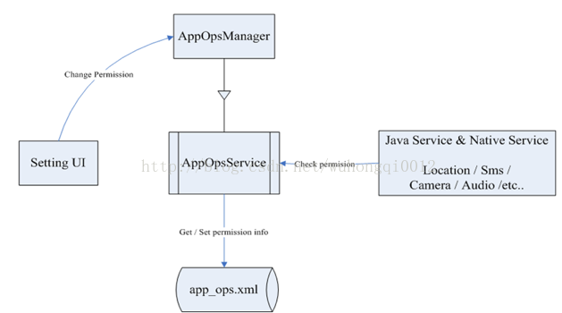
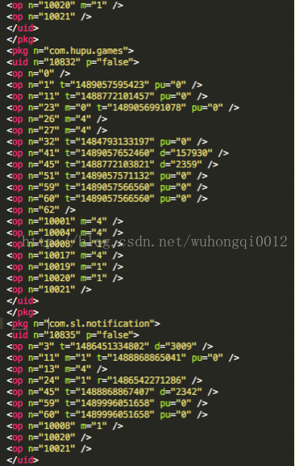

# SLNotification
- [x] [Android权限大全](./app/markdown/Android权限大全.md)

最近为了在部门内做一次小型的技术分享，深入了解了一下Notification的实现原理，以及Android的权限机制。在此做个记录，文章可能比较长，没耐心的话就直接看题纲吧。

先看一下下面两张图
图一：                   

           

看到这图可能大家不太明白，这和我们的notification有什么关系，我来简单介绍一下背景，这是发生在15年NBA季后赛期间，火箭队对阵小牛队，火箭队以3:1领先，只要再赢一场就能淘汰对手，这时候火箭队的官方首席运营官发了这条官方推特。翻译一下就是 “一把枪指着小牛的队标，哼哼，只需要闭上你们额眼睛，马上就要结束了”。这条推特当时引起了很多人的转发和评论，并且推送给了所有关注相关比赛的球迷以及媒体。我们试想一下，你是一个小牛的球迷，输了比赛以后本来心情就很差，这时候手机一震，收到这条通知栏推送，你是不是会有一种强烈的被蔑视感觉。当天推特上就掀起了一阵网络争议，不仅小牛球迷，其他中立球迷也表示这条推特讽刺意味十足，已经有侮辱对手的嫌疑了。当然了，通知栏表示我不背这个锅，谁来背？第二天，这位首席运营官就被火箭官方开除了，并宣称此推特仅代表前运营官个人意见与火箭队无任何关系。

图二：               

说完别人，再来说说我们自己吧。3月5日那天，群里都在讨论这条推送，本意是我们的编辑打算推一个分手相关的歌单，但是文案考虑不周全，让人误解。导致很多用户感到莫名其妙，我们试想一下，你准备与你最近交往的对象一起吃个晚餐，出门前收到这条祝我们分手的通知，你是不是感到很不爽呢。是的，在微博上随手一搜就发现有很多用户是这种不爽的感觉了。当然了我拿这个对比并没有说要炒这位编辑的鱿鱼噢。

好像偏题很远了，说这么多其实就是想说明一件事，应用程序的通知是非常重要的一环，处理的不好很可能给用户带来不好的印象，轻则吐槽，重则直接卸载。
好了好了，言归正传，我先列一下题纲吧                 

一、Notification的使用             
二、Notification跨进程通信的源码分析             
三、优雅地设计通知（7.0）             
四、通知权限问题             
五、安卓的权限机制（6.0）             
六、总结             

一、Notification的使用             
目前咱们酷狗里的通知使用主要有以下三种场景             
1.消息中心的通知             
2.下载歌曲的通知             
3.通过PlaybackService启动的通知             
下面简单分析一下这三种场景的通知是如何实现的。
第一种是使用系统布局生成的普通通知样式

        NotificationManagerCompat manager = NotificationManagerCompat.from(this);
        NotificationCompat.Builder builder = new NotificationCompat.Builder(this);
        builder.setContentTitle()  [1]
                .setLargeIcon()    [2]
                .setContentText()  [3]
                .setNumber()       [4]
                .setSmallIcon()    [5]
                .setWhen()         [6]
                .setContentIntent(pendingIntent);
        manager.notify(tag, id, builder.build());

第二种是使用自定义的布局生成的通知样式        

        NotificationManagerCompat manager = NotificationManagerCompat.from(this);
        NotificationCompat.Builder builder = new NotificationCompat.Builder(this);
                builder.setWhen()
                .setSmallIcon()
                .setLargeIcon()
                .setContentIntent(pendingIntent);
        RemoteViews remoteView = new RemoteViews(getPackageName,  R.layout.custom);
        remoteView.setTextViewText(R.id.tv_title,  “通知标题”);
        remoteView.setImageViewResource(R.id.iv_icon,  R.drawable.icon);
        remoteView.setOnClickPendingIntent(R.id.iv_icon, pendingIntent);
        builder.setContent(remoteView);
        manager.notify(tag, id, builder.build());      RemoteViews不支持自定义View等复杂View

这两点的共性就是都是先初始化NotificationManagerCompat，和NotificationCompat.Builder, 再经过一系列builder设值后通过manager.notify去发送通知，不同点是普通通知直接设置界面元素的值，而自定义通知是构造了一个remoteView的自定义布局，把它设置给builder的content。自定义通知呢有一点需要注意就是，这个自定义的布局里的TextView字体的大小和颜色需要合理地配置，不然很容易在不同系统中和其他app的通知展示方式不一样，导致用户通知栏因为这个而显得不美观，甚至很突兀。那么，官方也是有给我们提供这样的解决方案：

Android 5.0之前可用:

        android:style/TextAppearance.StatusBar.EventContent.Title    // 通知标题样式
        android:style/TextAppearance.StatusBar.EventContent             // 通知内容样式

Android 5.0及更高版本:

        android:style/TextAppearance.Material.Notification.Title         // 通知标题样式
        android:style/TextAppearance.Material.Notification                  // 通知内容样式

当然了这么处理的话应该能解决绝大部分手机的通知文字样式问题，但还是有一些被优化或者说改造过的系统，仍然不兼容这样的通知样式，这时候就需要通过build()一个默认通知，然后再去获取当前系统通知的文字和颜色的方式了。这种方式，可以来看看我们代码中如何实现的。

        public SystemNotification getSystemText() {
                mSystemNotification = new SystemNotification();

                try {
                    NotificationCompat.Builder builder = new NotificationCompat.Builder(this);
                    builder.setContentTitle("SLNOTIFICATION_TITLE")
                           .setContentText("SLNOTIFICATION_TEXT")
                           .setSmallIcon(R.drawable.comm_ic_notification)
                           .build();

                    LinearLayout group = new LinearLayout(this);
                    RemoteViews tempView = builder.getNotification().contentView;
                    ViewGroup event = (ViewGroup) tempView.apply(this, group);
                    recurseGroup(event);
                    group.removeAllViews();
                } catch (Exception e) {
                    mSystemNotification.titleColor = Color.BLACK;
                    mSystemNotification.titleSize = 32;
                    mSystemNotification.contentColor = Color.BLACK;
                    mSystemNotification.contentSize = 24;
                }

                return mSystemNotification;
            }

    private boolean recurseGroup(ViewGroup gp) {
        for (int i = 0; i < gp.getChildCount(); i++) {
            View v = gp.getChildAt(i);
            if (v instanceof TextView) {
                final TextView text = (TextView) v;
                final String szText = text.getText().toString();
                if ("SLNOTIFICATION_TITLE".equals(szText)) {
                    mSystemNotification.titleColor = text.getTextColors().getDefaultColor();
                    mSystemNotification.titleSize = text.getTextSize();
        //          return true;
                }
                if ("SLNOTIFICATION_TEXT".equals(szText)) {
                    mSystemNotification.contentColor = text.getTextColors().getDefaultColor();
                    mSystemNotification.contentSize = text.getTextSize();
        //          return true;
                }
            }
        //      if (v instanceof ImageView) {
        //          final ImageView image = (ImageView) v;
        //      if(image.getBackground().getConstantState().equals(getResources().getDrawable(R.drawable.comm_ic_notification))) {
        //          mSystemNotification.iconWidth = image.getWidth();
        //          mSystemNotification.iconHeight = image.getHeight();
        //      }
        //  }
            if (v instanceof ViewGroup) {// 如果是ViewGroup 遍历搜索
                recurseGroup((ViewGroup) gp.getChildAt(i));
            }
        }
        return false;
    }

至于具体如何实现的发送通知，我们待会再继续分析。        

而第三种通知比较特殊，是用service.startForground(notification)的方式生成的通知。
我们酷狗启动的时候就会在通知栏生成一个可以控制播放的通知，这个通知就是playbackdservice在启动的时候生成的。

        Notification notification = new Notification();
        notification.icon = R.drawable.icon;
        notification.flags = mFlag;
        notification.contentView = mContentView;
        notification.contentIntent = pendingIntent
        mService.startForeground(id, notification);

这个方法的注解是这样的：        

Make this service run in the foreground, supplying the ongoing notification to be shown to the user while in this state.By default services are background, meaning that if the system needs to kill them to reclaim more memory (such as to display a large page in a web browser), they can be killed without too much harm.  You can set this flag if killing your service would be disruptive to the user, such as if your service is performing background music playback, so the user would notice if their music stopped playing.        

二、Notification跨进程通信的源码分析        

我们的进程是如何将通知数据传递给系统进程的？        
系统进程又是如何拿到我们进程的资源去绘制通知栏界面的？        
关键在于RemoteViews        

        
那我们得好好了解一下这里的RemoteViews的工作原理，先看一张流程图        
        
        
        
我来解释一下这张图，本地进程和系统通知栏所在的系统进程是通过Binder来传输的。        
Notification内部本身有RemoteViews变量，当notification.Builder执行build()方法的时候，会把通知相关的数据及View操作等都通过一系列的addAction的方法存在RemoteViews里。在notificationManager真正执行notify()的时候，本地进程通过getService拿到binder对象,再生成NotificationManagerService的实例，service通过调用enqueueNotificationWithTag()方法将notification,pkgName,tag,id等等展示通知需要的数据都传递到系统进程。系统进程通过循环调用RemoteViews里的apply()方法，去获取到之前的view操作并执行，而系统进程要拿到本地进程的资源，则是通过context.createApplicationContext()先拿到和本地进程基本一样的context，然后再通过getResource(资源id)去获取资源。这样就很好地解释了remoteViews是如何跨进程通信的。这里我们要再跟进一下RemoteViews的源码，来验证这段流程。        

搞清楚了这点呢，我们再来看看之前一直存在于我们崩溃树当中的这个崩溃，量还不小。        

        
大致意思就是系统无法创建notification，因为通过资源id0x7f021b02找不到需要展示的通知icon，也就展示不了通知。        
而获取资源的方式，刚才我们讲到是通过context.createApplicationContext()拿到context，官方给出的解释是：Return a new Context object for the given application name. This Context is the same as what the named application gets when it is launched, containing the same resources and class loader. Each call to this method returns a new instance of a Context object; Context objects are not shared, however they share common state (Resources, ClassLoader, etc) so the Context instance itself is fairly lightweight.        

然后用context去getResource来获取资源，可以设想一下，因为这个资源id是在之前的build()操作的时候就已经把它传递到系统进程了，这时候如果本地进程覆盖升级后更换了资源映射表，这时候系统进程再执行getResource的话，用旧的资源id，当然就找不到资源了。        
目前我们酷狗的解决办法就是固化这一部分资源id，这样不论发多少新版本，通知栏需要的这些个资源都是同样的资源id，怎么拿都不会拿不到了。        
        

了解了remoteViews的跨进程通信这一块，咱们再继续跟进一下到底notification.notify(),经历了哪些具体的过程。下面还是有一张图、        

        
这张图清晰地描述了，通知的notify方法是如何触发到系统更新通知栏界面的，源码跟进讲解。        

主要是以下几个类
NotificationManager        
NotificationManagerService        
NotificationListenerService        
BaseStatusBar        
PhoneStatusBar        
StatusBarView        
HeadsUpManager        

三、优雅地设计通知        
        
这里有一张通知界面的对比图，上面的是7.0之前的系统通知栏布局，下面的是7.0的最新系统通知栏布局。具体变化图里已经表现的很清晰了。        
当然了，现在很多手机厂商也都在尝试使用自己定制的通知栏样式。这也就使得我们在做自定义通知的时候会遇到很多阻碍，很显然，因为厂商会自己来绘制通知样式，所以我们的程序要自定义通知的时候，很可能就和系统的样式差别很大，导致很丑的现象。只有当我们的通知本身就很特殊，不需要跟随系统的其他通知样式来展示时，才比较适合自定义布局，目前酷狗里的下载通知就有这样的问题。        
        
        
        
        

说到界面布局我想起来刚开始做通知的时候，遇到的一个小问题，这里也讲一下。为什么左上角的smallIcon看不到，是一团灰色呢。        
其实是从sdk21开始，Google要求，所有应用程序的通知栏图标，应该只使用alpha图层来进行绘制，而不应该包括RGB图层。通俗地说，就是我们的通知栏图标不要带颜色就可以了。        
原来如此，怪不得我之前在酷狗里看见这样的代码感到很好奇却不知道原因。        

        if (SystemUtils.getSdkInt() >= 21) {
            setSmallIcon(com.kugou.common.R.drawable.stat_notify_musicplayer_for5);
        } else {
            setSmallIcon(com.kugou.common.R.drawable.stat_notify_musicplayer);
        }
        
下面我们再来看看我认为比较优雅的使用通知的方式。        
1、进行中的通知        
2、监听清除事件的通知        
3、不同优先级的通知        
4、系统悬浮窗和锁屏的通知        
5、不同Style样式的通知        
6、Group通知        
7、可以直接回复的通知        
尤其是最后两点是7.0安卓系统独有的。        
https://material.io/guidelines/patterns/notifications.html#notifications-behavior        
这个网站是谷歌推出的设计平台有关通知这一块的设计吧。        
这一部分我们可以来看看我写的demo吧。        
        
四、通知权限问题        
说到通知栏就不得不提通知栏权限问题，之前我们的歌单推送功能，产品找到我说曝光量比点击量大很多，从技术上是什么原因导致用户收到以后并不去点击呢。        
因为之前的逻辑是只要执行了notify()方法就认为通知曝光了，这里设计是有问题的，因为很可能用户已经把我们程序的通知给禁止掉了。        
那我们怎么知道自己的应用程序通知权限被禁止了呢？如果被禁止了又该怎么办呢？        
带着这两个问题，我开始查阅资料了。        

1、API24开始系统就提供了现成的方法来获取通知权限        
NotificationManagerCompat.from(this).areNotificationEnable();        
2、还有一种方式就是通过反射获取        

        /**
             * 通过反射获取通知的开关状态
             * @param context
             * @return
             */
            public static boolean isNotificationEnabled(Context context){

        AppOpsManager mAppOps = (AppOpsManager) context.getSystemService(Context.APP_OPS_SERVICE);
        ApplicationInfo appInfo = context.getApplicationInfo();
        String pkg = context.getApplicationContext().getPackageName();
        int uid = appInfo.uid;
        Class appOpsClass = null; /* Context.APP_OPS_MANAGER */
        try {
            appOpsClass = Class.forName(AppOpsManager.class.getName());
            Method checkOpNoThrowMethod = appOpsClass.getMethod(CHECK_OP_NO_THROW, Integer.TYPE, Integer.TYPE, String.class);
            Field opPostNotificationValue = appOpsClass.getDeclaredField(OP_POST_NOTIFICATION);
            int value = (int)opPostNotificationValue.get(Integer.class);
            return ((int)checkOpNoThrowMethod.invoke(mAppOps,value, uid, pkg) == AppOpsManager.MODE_ALLOWED);
        } catch (Exception e) {
            e.printStackTrace();
        }
        return true;
    }
    
这种方式呢实质就是通过AppOpsManager和AppOpsService去获取位于/data/system/目录下的文件Appops.xml里的数据。这一块的流程我们待会再仔细描述一下。
好的，现在我们已经知道用户的权限了，如果确实被用户禁止了，我们有以下三个处理方式        
1、最友好的方式当然是给用户一个弹窗，对我们为什么需要通知作一下阐述，然后引导用户去打开权限。        
2、最不友好的方式就是通过AppOpsManager.setMode()方法去修改用户的权限        
3、通过自己设计一个悬浮窗来替代系统的通知        
第2种方式呢，在实践的时候发现执行就会抛出异常，下面是异常信息        
SecurityException  Java.lang.SecurityException: uid 10835 does not have android.permission.UPDATE_APP_OPS_STATS.        
非系统应用都没有修改权限的权限。如何知道是不是系统应用呢，就是这个uid了。看来谷歌已经把这条路给堵上了。        
第3种方式应该是目前比较普遍的做法了，产品希望一定要展示，那就只能这么绕弯子了。这里直接看项目里的OverlayUtils吧。不过悬浮窗又涉及到另一个悬浮窗的权限，需要用户打开才行，这么看来还是倾向于第一种让用户自己来决定吧。        
这里记录一下，我测试了两款手机        
华为：打开了通知，无论有没有打开悬浮窗权限，都能弹出悬浮窗        
   关闭了通知，需要打开悬浮窗权限才能弹出悬浮窗        
小米：悬浮窗只受悬浮窗权限控制，和是否打开通知没有关系        

说完通知栏我们再看看，为什么我把通知栏权限禁止后，程序的Toast提示也都显示不了了。        
查阅源码后发现 Toast里也用到了NotificationManagerService。在Toast执行show()方法后，走到enqueueToast的时候有这么一段代码        

        if (ENABLE_BLOCKED_TOASTS && !noteNotificationOp(pkg, Binder.getCallingUid())) {
            if (!isSystemToast) {
                Slog.e(TAG, "Suppressing toast from package " + pkg + " by user request.");
                return;
            }
        }
原来如此，这里也用到了检测通知权限的方法noteNotificationOp()。        
Toast也被notification影响了，可是我们的程序里Toast无处不在，因为通知权限导致toast弹不出影响挺大的。那我们找找看替代方案吧，其实和通知类似。前面几种就不说了。        
其实也是用WindowManager 悬浮窗，只不过先通过系统toast拿到布局来用，这样显示效果就和系统toast一样了。        

        
五、安卓的权限机制（6.0）        
这里说到安卓的权限，我就想讲讲我还在实习的时候遇到的一个相关问题。balabalabala        
当targetSdkVersion值为23以下（也就是android 6.0）的时候，权限是在程序安装的时候便询问了用户，并配置好。        
但是当targetSdkVersion值为23或23以上的时候，权限是当使用的时候才会询问用户，如果代码不变的情况下，直接使用使用危险权限，程序会直接崩溃        
java.lang.SecurityException: Permission Denial        
目前酷狗为21，暂时还不会出现这个问题        
官方已经提供了一套流程来配合app与用户之间的权限交互。        
那targetSdkVersion是否该提升？官方说当用户设备与targerSdkVersion一致的时候，程序运行效率会提高，因为会少处理很多兼容性问题，有待考证。        
我们来看看6.0下的权限流程        
左图是标准流程，右图是用户操作了不再提示        
        
        

        
鉴权（检测权限）这一步来说一说。这个之前提到过的AppOpsManager        
        

Setting UI通过AppOpsManager与AppOpsService交互，给用户提供入口管理各个app的操作。        

AppOpsService具体处理用户的各项设置，用户的设置项存储在 /data/system/appops.xml文件中。        
AppOpsService也会被注入到各个相关的系统服务中，进行权限操作的检验。        

各个权限操作对应的系统服务（比如定位相关的Location Service，Audio相关的Audio Service等）中注入AppOpsService的判断。如果用户做了相应的设置，那么这些系统服务就要做出相应的处理。        
（比如，LocationManagerSerivce的定位相关接口在实现时，会有判断调用该接口的app是否被用户设置成禁止该操作，如果有该设置，就不会继续进行定位。）        

那这个appops.xml文件长啥样呢，我们来看看        

op标签中        
n标识权限的opCode，        
t表示时间戳，        
m标识权限值mode，有三种        
1.MODE_ALLOWED = 0;        
2.MODE_IGNORED = 1;        
3.MODE_ERRORED = 2;        

如果没有m值，则为默认值，每种权限都有一种对应默认值，在AppOpsManager.sOpDefaultMode数组中，这是一个int数组，下标代表opCode,内容代表默认权限值。其他属性可以参考writeState方法一一对应        

六、总结        
一、通知的选择        
1.不依赖系统版本都要显示同样UI的可以使用自定义通知（例如酷狗播放通知）        
2.需要与安卓系统版本UI保持一致的使用系统通知（例如酷狗消息通知）        
3.当你需要保护你的Service不被系统优先Kill掉，可以用service.startForeground(notification)        
二、做通知栏拓展的时候尽可能考虑7.0的通知栏特性（因为这些都是官方针对人性化用户体验设计的）        
三、当需要跨进程使用View的时候可以考虑RemoteViews        
四、当通知权限受阻，考虑使用替代方案（悬浮窗等）        
五、建立完善的权限询问机制（针对targetSdkVersion，提高效率且提升用户体验）        
